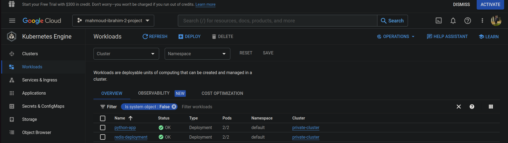
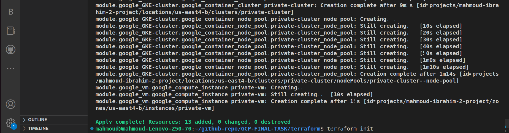
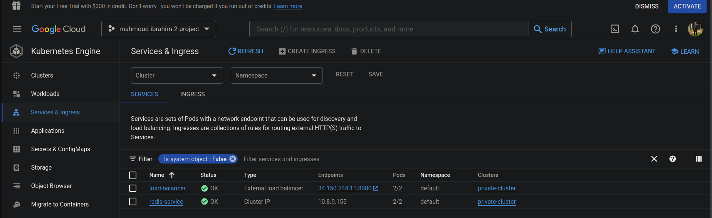
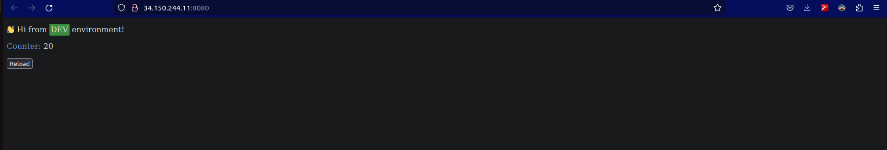

# provision infrastructure using terraform

### Build Docker image for the pyhton app from the Dockerfile, and upload the image to gcr
  ```
docker build -t python .
  ```
  ```
docker tag python gcr.io/mahmoud-ibrahim-2-project/python-app/python
  ```
  ```
docker push gcr.io/mahmoud-ibrahim-2-project/python-app/python
  ```

### Pull redis image from docker hub then push it to gcr



### For the terraform code
```
terraform init
```
```
terraform plan
```
```
terraform apply
```



### SSH to the private VM:

#### Install gcloud & Install kubectl & Install plugin
```
sudo apt install -y apt-transport-https ca-certificates gnupg
```
```
echo "deb [signed-by=/usr/share/keyrings/cloud.google.gpg] https://packages.cloud.google.com/apt    cloud-sdk main" | sudo tee -a /etc/apt/sources.list.d/google-cloud-sdk.list
```
```
curl https://packages.cloud.google.com/apt/doc/apt-key.gpg | sudo tee /usr/share/keyrings/cloud.google.gpg
```
```
sudo apt-get update && sudo apt-get install -y google-cloud-cli
```
```
sudo apt-get install kubectl
```
```
sudo apt-get install google-cloud-sdk-gke-gcloud-auth-plugin
```

#### Connect To Kubernetes Cluster
```
sudo gcloud container clusters get-credentials private-cluster --zone us-east4-b --project mahmoud-ibrahim-2-project
```

### Create a storage bucket and upload deployment yaml files to it
#### Then copy the deployment yaml files from bucket to VM
```
sudo gsutil cp -r gs://mmelegy.bucket.yaml/GKE-k8s /home/mahmoud/
```

#### Apply All yaml Files
```
sudo kubectl create -Rf /home/mahmoud/GKE-k8s
```

### Get the load balancer IP and port to test it




### Expected to find this website 

